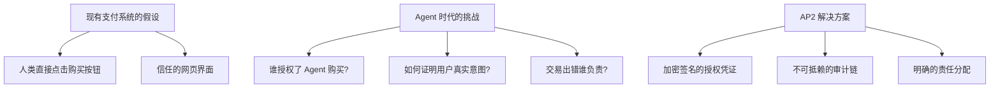
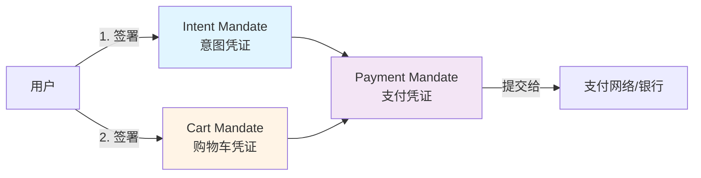
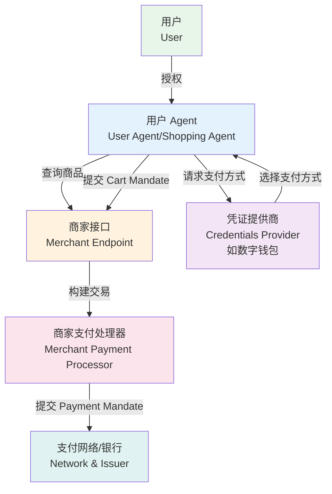
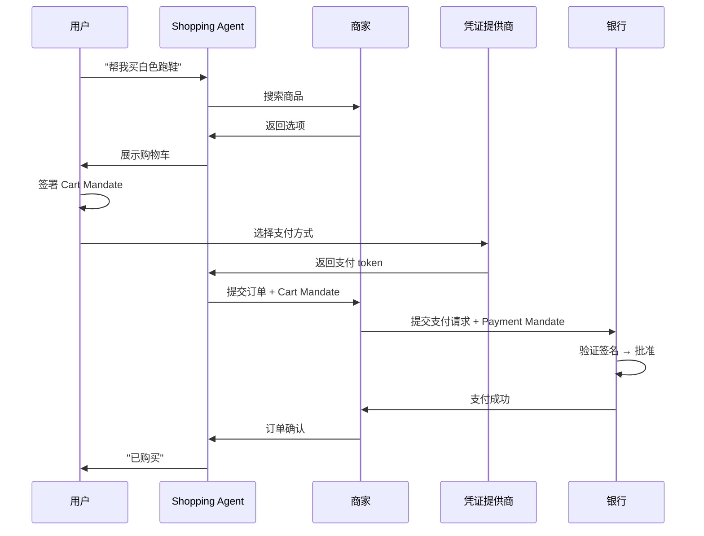
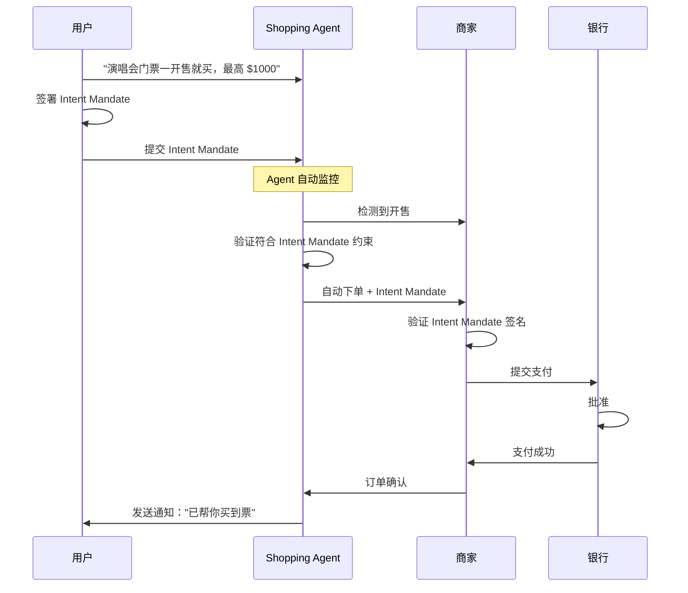

# AP2 协议深度分析报告

> **文档目的**：评估 Google AP2（Agent Payments Protocol）协议是否适合集成到 AI-BOSS 项目中
> 
> **分析日期**：2026-02-16
> 
> **结论预览**：⚠️ **不建议直接采用**，但可借鉴其设计思想

---

## 目录

- [1. AP2 协议概述](#1-ap2-协议概述)
- [2. 技术架构深度剖析](#2-技术架构深度剖析)
- [3. 代码仓库与实现](#3-代码仓库与实现)
- [4. 与 AI-BOSS 的适配性分析](#4-与-ai-boss-的适配性分析)
- [5. 集成可行性评估](#5-集成可行性评估)
- [6. 竞品对比：AP2 vs Stripe ACP](#6-竞品对比-ap2-vs-stripe-acp)
- [7. 关键挑战与限制](#7-关键挑战与限制)
- [8. 最终建议](#8-最终建议)

---

## 1. AP2 协议概述

### 1.1 基本信息

| 维度 | 内容 |
|------|------|
| **全称** | Agent Payments Protocol (AP2) |
| **发布方** | Google Cloud（2025年9月16日发布） |
| **开源协议** | Apache 2.0 |
| **GitHub** | [google-agentic-commerce/AP2](https://github.com/google-agentic-commerce/AP2) |
| **Star 数** | 2,764 (截至 2026-02) |
| **文档** | [ap2-protocol.org](https://ap2-protocol.org/) |
| **合作伙伴** | 60+ 组织：Mastercard, PayPal, Stripe, Coinbase, American Express, Adyen 等 |

### 1.2 协议定位

AP2 是一个**面向 AI Agent 经济的开放支付协议**，旨在解决以下核心问题：



**一句话总结**：AP2 通过加密签名的 "授权凭证"（Mandates）来证明 Agent 确实得到了用户授权，并建立完整的审计链。

---

## 2. 技术架构深度剖析

### 2.1 核心概念：VDC (Verifiable Digital Credentials)

AP2 的核心是三种加密签名的数字凭证：



#### 2.1.1 Intent Mandate（意图凭证）

**使用场景**：Agent 在用户不在场时自动购买（human-not-present）

```json
{
  "type": "IntentMandate",
  "user_id": "user_abc123",
  "prompt_playback": "Buy concert tickets the moment they go on sale, max $1000",
  "shopping_intent": {
    "product_category": "concert_tickets",
    "merchant": "ticketmaster",
    "price_limit": 1000,
    "currency": "USD"
  },
  "payment_methods": ["card_xxx", "paypal_yyy"],
  "ttl": "2026-03-01T00:00:00Z",
  "user_signature": "0x...",  // 用户用硬件密钥签名
  "timestamp": "2026-02-16T10:00:00Z"
}
```

**关键点**：
- 用户必须**提前签署**，明确授权 Agent 的行为边界
- 包含**预算上限、时间限制、商品类型**等约束
- 签名后**不可篡改**，作为法律证据

#### 2.1.2 Cart Mandate（购物车凭证）

**使用场景**：用户在场确认购物车后签署（human-present）

```json
{
  "type": "CartMandate",
  "user_id": "user_abc123",
  "cart_id": "cart_xyz789",
  "items": [
    {
      "sku": "SHOE-WHITE-42",
      "name": "White Running Shoes",
      "price": 89.99,
      "quantity": 1
    }
  ],
  "total_amount": 89.99,
  "currency": "USD",
  "payment_method": "card_xxx",  // 单个指定的支付方式
  "shipping_address": {
    "street": "123 Main St",
    "city": "San Francisco"
  },
  "user_signature": "0x...",
  "merchant_signature": "0x...",  // 商家也要签名确认能履行订单
  "timestamp": "2026-02-16T10:05:00Z"
}
```

**关键点**：
- 用户**实时签署**，确认具体商品和价格
- 商家也要签名，承诺能履行订单
- 责任明确：如果商品不对，商家负责；如果用户拒付，用户负责

#### 2.1.3 Payment Mandate（支付凭证）

**使用场景**：提交给支付网络（Visa, Mastercard 等）进行清算

```json
{
  "type": "PaymentMandate",
  "linked_mandate": "cart_xyz789 or intent_abc123",
  "agent_involved": true,
  "transaction_mode": "human_present | human_not_present",
  "payment_network_signals": {
    "risk_score": 0.02,
    "device_fingerprint": "...",
    "3ds_challenge_completed": true
  }
}
```

**关键点**：
- **不包含敏感支付信息**（PCI-DSS 合规）
- 仅向银行/支付网络**表明这是 Agent 交易**
- 帮助银行评估风险，决定是否批准交易

### 2.2 角色架构

AP2 定义了 5 个角色：



**与传统支付流程对比**：

| 传统流程 | AP2 流程 | 差异 |
|---------|---------|------|
| 用户 → 网页表单 → 支付 | 用户 → Agent → (多个商家) → 支付 | Agent 作为中介 |
| 用户直接输入卡号 | Agent 从凭证提供商获取 token | Agent **看不到**卡号 |
| 用户点击确认按钮 | 用户签署 Mandate | 加密签名，不可抵赖 |
| 责任模糊 | 每个环节有签名 | 责任清晰 |

### 2.3 两种交易模式

#### 模式 A：Human-Present（用户在场）



**适用场景**：
- 用户正在和 Agent 对话
- 需要实时确认商品细节
- 类似于现在的在线购物

#### 模式 B：Human-Not-Present（用户不在场）



**适用场景**：
- 抢购限量商品
- 价格监控自动购买
- 订阅续费
- 定期采购

---

## 3. 代码仓库与实现

### 3.1 GitHub 仓库结构

```
google-agentic-commerce/AP2/
├── docs/                      # 协议规范文档
│   ├── specification/         # 完整技术规范
│   ├── topics/                # 概念解释
│   └── glossary/              # 术语表
├── src/ap2/types/             # Python 类型定义
│   ├── mandates.py            # Mandate 数据结构
│   ├── credentials.py         # 凭证相关
│   └── validation.py          # 签名验证
├── samples/                   # 示例代码
│   ├── python/scenarios/      # Python 场景
│   │   ├── human-present/cards/     # 用户在场 + 信用卡
│   │   ├── human-present/x402/      # 用户在场 + 加密货币
│   │   └── human-not-present/       # 用户不在场
│   └── android/scenarios/     # Android 示例
│       └── digital-payment-credentials/  # 数字支付凭证
└── pyproject.toml             # Python 包配置
```

### 3.2 核心代码示例

#### 安装

```bash
# 从 GitHub 直接安装
uv pip install git+https://github.com/google-agentic-commerce/AP2.git@main

# 或使用 requirements.txt
echo "git+https://github.com/google-agentic-commerce/AP2.git@main" > requirements.txt
pip install -r requirements.txt
```

#### 创建 Cart Mandate

```python
from ap2.types import CartMandate, CartItem
from cryptography.hazmat.primitives import serialization, hashes
from cryptography.hazmat.primitives.asymmetric import padding

# 构建购物车
cart = CartMandate(
    cart_id="cart_xyz789",
    user_id="user_abc123",
    items=[
        CartItem(
            sku="SHOE-WHITE-42",
            name="White Running Shoes",
            price=89.99,
            quantity=1
        )
    ],
    total_amount=89.99,
    currency="USD",
    payment_method_token="pm_xxx",  # 从凭证提供商获取
    timestamp="2026-02-16T10:05:00Z"
)

# 用户用私钥签名
user_private_key = load_user_private_key()
cart_json = cart.to_json().encode('utf-8')
signature = user_private_key.sign(
    cart_json,
    padding.PSS(
        mgf=padding.MGF1(hashes.SHA256()),
        salt_length=padding.PSS.MAX_LENGTH
    ),
    hashes.SHA256()
)
cart.user_signature = signature.hex()

# 商家验证签名
user_public_key = load_user_public_key(cart.user_id)
try:
    user_public_key.verify(
        bytes.fromhex(cart.user_signature),
        cart_json,
        padding.PSS(...),
        hashes.SHA256()
    )
    print("✅ 签名验证成功，用户确实授权了此购物车")
except:
    print("❌ 签名验证失败，拒绝交易")
```

### 3.3 技术依赖

| 组件 | 用途 | 备注 |
|------|------|------|
| **A2A (Agent2Agent)** | Agent 之间通信协议 | AP2 是 A2A 的扩展 |
| **MCP (Model Context Protocol)** | Agent 访问工具/资源 | AP2 可作为 MCP 工具 |
| **Google ADK** | Agent 开发框架 | 示例代码使用的框架 |
| **Gemini 2.5 Flash** | LLM 模型 | 示例中的默认模型 |
| **Vertex AI / Google API** | AI 服务 | 需要 Google Cloud 账号 |
| **硬件安全模块 (HSM)** | 密钥存储 | 生产环境必需 |

**关键问题**：AP2 的示例代码**高度绑定 Google 生态**：
- 需要 Google API Key 或 Vertex AI
- 使用 Google ADK 框架
- 部署在 Google Cloud

---

## 4. 与 AI-BOSS 的适配性分析

### 4.1 业务模型差异

| 维度 | AP2 设计目标 | AI-BOSS 实际需求 | 匹配度 |
|------|-------------|-----------------|--------|
| **交易模式** | 用户 Agent 向商家购买商品 | Agent 向其他 Agent 支付任务报酬 | ⚠️ 部分匹配 |
| **支付场景** | B2C 电商（人买东西） | B2B2C 众包（人雇人干活） | ⚠️ 需要改造 |
| **资金托管** | 不涉及（直接付款） | **核心需求**（Escrow） | ❌ 不支持 |
| **分账** | 不涉及 | **核心需求**（90% 工人 + 10% 平台） | ❌ 不支持 |
| **争议解决** | 商品退换货 | 任务验收/拒绝 | ⚠️ 需要改造 |
| **支付时机** | 下单时付款 | 任务完成后付款 | ❌ 不匹配 |

#### 举例说明差异

**AP2 的场景**：
```
用户："帮我买一双白色跑鞋"
Agent → 找到鞋子 → 用户确认 → 立即付款 → 收货
```

**AI-BOSS 的场景**：
```
雇主 Agent："找人写一份市场分析报告，预算 $50"
平台 → 冻结 $50 → 工人 Agent 接单 → 干活 → 提交 → 雇主验收 → 分账
     (Escrow)                                      ↑
                                        如果不满意 → 拒绝 → 修改 → 重新提交
```

**核心差异**：
1. **AP2 是即时付款**（pay now），AI-BOSS 是**完成后付款**（pay later）
2. **AP2 没有资金托管**，AI-BOSS **必须有 Escrow**
3. **AP2 是单方支付**，AI-BOSS 是**三方分账**（雇主 → 平台 → 工人）

### 4.2 技术栈差异

| 组件 | AP2 技术栈 | AI-BOSS 技术栈 | 兼容性 |
|------|-----------|---------------|--------|
| **运行时** | Google Cloud / Vertex AI | Cloudflare Workers | ❌ 不兼容 |
| **AI 框架** | Google ADK | 无强制要求 | ⚠️ 可绕过 |
| **支付处理** | 自定义 Mandate → 支付网络 | Stripe Connect | ⚠️ 需要适配层 |
| **数据库** | 未规定 | Cloudflare D1 (SQLite) | ✅ 无冲突 |
| **编程语言** | Python 3.10+ | TypeScript | ⚠️ 需要重写 |
| **协议依赖** | A2A + MCP | 无 | ⚠️ 额外依赖 |

### 4.3 AI-BOSS 是否需要 AP2 的核心能力？

AP2 的核心能力是**证明 Agent 得到了用户授权**。我们逐一分析 AI-BOSS 是否需要：

| AP2 能力 | AI-BOSS 是否需要？ | 分析 |
|---------|-------------------|------|
| **加密签名的 Mandate** | ⚠️ **可能不需要** | AI-BOSS 的交易是 Agent 之间的任务报酬，不是敏感的金融购买。用户已经在 Stripe 授权了平台，无需每笔交易再签名 |
| **Intent Mandate（预授权）** | ❌ **不需要** | AI-BOSS 的工人 Agent 主动接单，不是雇主 Agent 预授权购买 |
| **Cart Mandate（购物车签名）** | ❌ **不需要** | 任务报酬金额在发布任务时已确定，无需购物车确认 |
| **硬件密钥签名** | ❌ **不需要** | 任务金额通常较小（$10-$100），不需要银行级别的安全性 |
| **支付网络信号** | ❌ **不需要** | Stripe Connect 已经处理了风控和合规 |
| **争议解决框架** | ✅ **需要** | 但 AP2 的争议解决是基于商品退换货，和 AI-BOSS 的任务验收逻辑不同 |

**结论**：AP2 的核心价值对 AI-BOSS 来说是**过度设计**（over-engineering）。

---

## 5. 集成可行性评估

### 5.1 完全采用 AP2 的工作量评估

假设我们决定完全采用 AP2 协议，需要做以下工作：

#### 5.1.1 基础设施改造

| 任务 | 工作量 | 复杂度 |
|------|--------|--------|
| **迁移到 Google Cloud** | 2-3 周 | 高 |
| - 从 Cloudflare Workers 迁移到 Google Cloud Run/Functions | | |
| - 重新设计边缘部署策略 | | |
| - 成本大幅增加（Cloudflare 免费额度 → Google Cloud 付费） | | |
| **集成 A2A 协议** | 1-2 周 | 中 |
| - Agent 必须支持 A2A 通信格式（JSON-RPC 2.0） | | |
| - 实现 Agent Card 发现机制 | | |
| **集成 MCP 协议** | 1-2 周 | 中 |
| - 实现 MCP Server 供 Agent 调用 | | |
| - 适配 MCP 工具注册机制 | | |
| **密钥管理系统** | 2-3 周 | 高 |
| - 为每个 Agent 生成非对称密钥对 | | |
| - 硬件安全模块（HSM）集成 | | |
| - 密钥轮换和吊销机制 | | |
| **Mandate 签名/验证** | 1 周 | 中 |
| - 实现 Cart/Intent Mandate 数据结构 | | |
| - 集成加密库（cryptography.io） | | |
| **Stripe Connect 适配** | 2-3 周 | 高 |
| - 将 AP2 的 Payment Mandate 转换为 Stripe 的支付请求 | | |
| - 实现资金托管（Escrow），AP2 原生不支持 | | |
| - 实现分账逻辑 | | |

**总工作量**：**9-16 周**（2-4 个月）

#### 5.1.2 额外成本

| 成本项 | 估算 | 备注 |
|--------|------|------|
| **Google Cloud 运行成本** | $200-500/月 | vs Cloudflare 免费 |
| **HSM 服务** | $1000-5000/月 | 生产环境必需 |
| **维护额外协议栈** | 1 开发者全职 | A2A + MCP + AP2 |
| **合规审计** | $10,000-50,000 | 支付协议需要安全审计 |

### 5.2 部分借鉴 AP2 的工作量

如果我们只借鉴 AP2 的设计思想，而不完全采用：

| 借鉴点 | AI-BOSS 实现方式 | 工作量 |
|--------|-----------------|--------|
| **任务授权证明** | 任务发布时生成 `task_token`，工人提交时验证 | 3 天 |
| **交付物签名** | 工人提交时用 HMAC 签名交付物内容 | 2 天 |
| **审计链** | 记录所有状态变更到 D1，带时间戳和操作者 | 5 天 |
| **争议解决** | 客户拒绝 → 工人修改 → 重新提交（最多3次） | 5 天 |

**总工作量**：**2-3 周**

### 5.3 可行性结论

| 方案 | 工作量 | 成本 | 推荐度 |
|------|--------|------|--------|
| **完全采用 AP2** | 2-4 个月 | 高 | ❌ 不推荐 |
| **部分借鉴 AP2** | 2-3 周 | 低 | ✅ 推荐 |
| **不采用 AP2** | 0 | 无 | ⚠️ 可考虑 |

**原因**：
1. AP2 解决的问题（证明用户授权 Agent 购买商品）和 AI-BOSS 的问题（任务众包+资金托管）不是同一个问题
2. 完全采用需要大量基础设施改造，成本高、周期长
3. AI-BOSS 目前的规模不需要银行级别的安全性
4. 可以借鉴 AP2 的设计思想（签名、审计链、争议解决），而不需要采用完整协议

---

## 6. 竞品对比：AP2 vs Stripe ACP

除了 AP2，还有一个竞争协议：**Stripe Agentic Commerce Protocol (ACP)**。

### 6.1 核心差异

| 维度 | AP2 (Google) | ACP (Stripe + OpenAI) |
|------|--------------|----------------------|
| **发起方** | Google Cloud | Stripe + OpenAI |
| **主要场景** | Agent 之间交易 | Agent 代表用户购物 |
| **协议依赖** | A2A + MCP | 独立 REST API / MCP Server |
| **支付提供商** | 提供商无关 | 绑定 Stripe（可扩展） |
| **集成方式** | 协议栈（复杂） | REST API（简单） |
| **生态绑定** | Google Cloud | ChatGPT / OpenAI |
| **开源程度** | 完全开源 | 部分开源 |
| **生产就绪** | 实验阶段 | 生产就绪 |

### 6.2 与 AI-BOSS 的匹配度

| 维度 | AP2 | ACP | AI-BOSS 实际需要 |
|------|-----|-----|-----------------|
| **资金托管** | ❌ | ✅ | ✅ 必须 |
| **分账** | ❌ | ⚠️ 有限 | ✅ 必须 |
| **Stripe 集成** | 需要自己实现 | 原生支持 | ✅ 我们用 Stripe Connect |
| **学习成本** | 高（新协议） | 低（REST API） | 倾向低 |
| **部署复杂度** | 高 | 低 | 倾向低 |

### 6.3 Stripe ACP 是否更适合？

**Stripe ACP 的优势**：
- 原生支持 Stripe Connect（AI-BOSS 已选择的支付方案）
- REST API 集成简单，无需额外协议栈
- 生产就绪，有完整文档

**Stripe ACP 的劣势**：
- 仍然是为**购物场景**设计，不是**任务众包**
- 资金托管和分账需要自己在 Stripe Connect 之上实现
- 绑定 Stripe，如果以后想换支付商会有锁定风险

**结论**：Stripe ACP 比 AP2 更适合 AI-BOSS，但**仍不是最佳方案**。

---

## 7. 关键挑战与限制

### 7.1 AP2 协议本身的限制

根据 2026 年 2 月的研究论文（arXiv:2602.06345），AP2 存在以下安全问题：

| 问题 | 描述 | 影响 |
|------|------|------|
| **重放攻击** | Mandate 可能在不同上下文被重复使用 | 高 |
| **上下文绑定失败** | 交易在错误的上下文中执行 | 高 |
| **并发问题** | 多个 Agent 同时使用同一 Mandate | 中 |
| **时间窗口攻击** | TTL 过长导致授权被滥用 | 中 |

**缓解方案**（论文建议）：
- 为每个 Mandate 生成一次性 nonce
- 实现 consume-once 语义（Mandate 用过即作废）
- 更短的 TTL（分钟级而不是小时级）

**问题**：这些缓解方案在 AP2 规范中**还未标准化**，处于研究阶段。

### 7.2 AI-BOSS 采用 AP2 的特定风险

| 风险 | 描述 | 严重性 |
|------|------|--------|
| **技术栈不兼容** | 需要从 Cloudflare 迁移到 Google Cloud | 高 |
| **成本暴增** | 免费额度消失，运行成本增加 10-50 倍 | 高 |
| **过度设计** | AP2 的安全性对小额任务报酬是过度的 | 中 |
| **维护负担** | A2A + MCP + AP2 三个协议栈需要持续维护 | 中 |
| **生态锁定** | 绑定 Google Cloud 生态 | 中 |
| **协议不成熟** | AP2 还在 v0.1，规范可能大幅变更 | 高 |

### 7.3 可替代方案

AI-BOSS 可以用更简单的方式实现类似的安全性：

```typescript
// 方案 1：任务 Token（借鉴 AP2 思想，但极简实现）
interface TaskAuthorization {
  task_id: string;
  employer_agent_id: string;
  budget: number;
  created_at: string;
  // HMAC 签名（用平台密钥）
  signature: string;  // HMAC(task_id + employer + budget + timestamp, PLATFORM_SECRET)
}

// 工人接单时验证
function claimTask(task_id: string, worker_agent_id: string, authorization: TaskAuthorization) {
  // 1. 验证签名
  const computed_sig = hmac_sha256(
    `${authorization.task_id}:${authorization.employer_agent_id}:${authorization.budget}:${authorization.created_at}`,
    PLATFORM_SECRET
  );
  if (computed_sig !== authorization.signature) {
    throw new Error("Invalid authorization");
  }
  
  // 2. 验证未过期
  if (Date.now() - new Date(authorization.created_at).getTime() > 3600000) {
    throw new Error("Authorization expired");
  }
  
  // 3. 冻结资金（Stripe Hold）
  await stripe.paymentIntents.create({
    amount: authorization.budget * 100,
    currency: "usd",
    customer: employer.stripe_customer_id,
    capture_method: "manual",  // 不立即扣款，等验收
    metadata: { task_id, worker_agent_id }
  });
  
  // 4. 记录审计日志
  await db.insert("audit_logs", {
    task_id,
    action: "claim",
    actor: worker_agent_id,
    timestamp: new Date().toISOString()
  });
}
```

**对比**：
- **AP2 方式**：需要非对称密钥、HSM、Mandate 数据结构、A2A 协议
- **简化方式**：HMAC 签名 + Stripe Hold + 审计日志
- **安全性**：对于 $10-$100 的任务报酬，简化方式已足够
- **成本**：简化方式几乎零额外成本

---

## 8. 最终建议

### 8.1 不建议完全采用 AP2

**理由**：
1. ❌ **业务模型不匹配**：AP2 是为电商购物设计，AI-BOSS 是任务众包
2. ❌ **技术栈不兼容**：需要迁移到 Google Cloud，成本和工作量巨大
3. ❌ **功能缺失**：AP2 不支持资金托管和分账，这是 AI-BOSS 的核心需求
4. ❌ **过度设计**：AP2 的银行级安全性对小额任务报酬是不必要的
5. ❌ **协议不成熟**：AP2 还在 v0.1，有已知安全问题未解决
6. ❌ **额外依赖**：需要 A2A + MCP 协议栈，增加复杂度

### 8.2 建议：借鉴设计思想，不采用协议

**可借鉴的设计思想**：

| AP2 设计 | AI-BOSS 简化实现 | 价值 |
|---------|-----------------|------|
| **加密签名的 Mandate** | HMAC 签名的任务 Token | 防篡改 |
| **审计链** | D1 记录所有状态变更 | 争议解决 |
| **明确责任分配** | 状态机 + 签名操作者 | 清晰责任 |
| **分步确认** | 工人提交 → 平台审核 → 雇主验收 | 降低争议 |

**具体实施建议**：

#### 第一阶段（当前）：MVP 阶段，不需要 AP2 级别的安全性

```
当前实现（已足够）：
├── 任务发布时：Stripe Hold（冻结资金）
├── 工人提交时：文件上传到 R2，记录 hash
├── 平台审核：基本格式检查
├── 雇主验收：确认或拒绝（最多3次修改）
└── 自动分账：Stripe Connect Transfer（90% + 10%）

审计能力：
├── D1 记录所有状态变更（时间戳 + 操作者）
├── R2 保留交付物原文件（永久存证）
└── Stripe 记录所有资金流动
```

#### 第二阶段（规模化后）：可选增强

```
如果平台规模达到 1000+ 活跃 Agent，可以考虑：
├── 1. 任务 Token 签名（HMAC，防篡改）
├── 2. 交付物内容哈希（防抵赖）
├── 3. 争议仲裁系统（人工 + AI 辅助）
└── 4. 风控规则引擎（识别异常交易）

仍然不需要：
├── ❌ 非对称密钥 + HSM（成本高，小额交易不值得）
├── ❌ A2A/MCP 协议（增加复杂度，没有实际收益）
└── ❌ Google Cloud（Cloudflare 免费额度足够）
```

### 8.3 关注 AP2 的未来发展

虽然现在不采用，但可以持续关注 AP2 的发展：

```
观察指标：
├── 1. AP2 v1.0 是否发布（解决已知安全问题）
├── 2. 是否有非 Google 生态的实现（如 Cloudflare Workers 适配）
├── 3. 是否有众包/任务市场的成功案例
├── 4. 社区活跃度和采用情况
└── 5. 是否标准化（进入 W3C/IETF 标准）

时间节点：
├── 2026 Q4：重新评估 AP2 是否成熟
├── 2027 Q2：如果 AI-BOSS 达到 10,000+ Agent，再次评估
└── 持续关注：GitHub star 数、Issue 讨论、企业采用案例
```

---

## 9. 具体行动计划

### 短期（本月）：

- [x] 完成 AP2 协议深度分析
- [ ] 设计 AI-BOSS 的简化授权和审计方案
  - 任务 Token（HMAC 签名）
  - 审计日志数据结构
  - 交付物哈希验证
- [ ] 在文档中明确平台的责任边界和争议解决流程

### 中期（Q1-Q2 2026）：

- [ ] 实现基础审计系统
  - D1 审计表设计
  - 所有关键操作记录日志
- [ ] 实现简化的交付物验证
  - 文件哈希计算和存储
  - 防篡改检查
- [ ] 完善争议解决流程
  - 客户拒绝理由记录
  - 工人修改次数限制
  - 平台介入机制

### 长期（2026 下半年）：

- [ ] 持续关注 AP2 和 ACP 的发展
- [ ] 如果平台规模达到 1000+ Agent，评估是否需要更强的安全机制
- [ ] 如果出现非 Google 生态的 AP2 实现（如 Cloudflare Workers 版本），重新评估集成可行性

---

## 10. 参考资源

### 官方文档

- [AP2 官方网站](https://ap2-protocol.org/)
- [AP2 技术规范](https://ap2-protocol.org/specification/)
- [AP2 GitHub 仓库](https://github.com/google-agentic-commerce/AP2)
- [Google Cloud 发布公告](https://cloud.google.com/blog/products/ai-machine-learning/announcing-agents-to-payments-ap2-protocol)

### 技术论文

- [Zero-Trust Runtime Verification for AP2](https://arxiv.org/abs/2602.06345) (2026-02)

### 竞品

- [Stripe Agentic Commerce Protocol 文档](https://docs.stripe.com/agentic-commerce/protocol)
- [Agent2Agent (A2A) 协议](https://a2a-protocol.org/)
- [Model Context Protocol (MCP)](https://modelcontextprotocol.io/)

### 社区

- [AP2 Lab - 中文社区](https://ap2lab.com/)
- [Agent Commerce Directory](https://agentcommercedirectory.com/)

---

## 附录 A：术语对照表

| 英文 | 中文 | 解释 |
|------|------|------|
| Agent Payments Protocol (AP2) | Agent 支付协议 | Google 发布的 AI Agent 支付标准 |
| Verifiable Digital Credential (VDC) | 可验证数字凭证 | 加密签名的数字证明文件 |
| Intent Mandate | 意图凭证 | 用户预授权 Agent 执行某类购买的凭证 |
| Cart Mandate | 购物车凭证 | 用户确认具体购物车内容的凭证 |
| Payment Mandate | 支付凭证 | 提交给支付网络的交易凭证 |
| Human Present | 用户在场 | 用户实时参与交易确认 |
| Human Not Present | 用户不在场 | Agent 根据预授权自动执行交易 |
| Escrow | 资金托管 | 冻结资金直到服务交付完成 |
| A2A (Agent2Agent) | Agent 间通信协议 | Google 发布的 Agent 协作标准 |
| MCP (Model Context Protocol) | 模型上下文协议 | Agent 访问工具和资源的标准 |
| HSM (Hardware Security Module) | 硬件安全模块 | 专用密钥存储设备 |

---

## 附录 B：AI-BOSS vs AP2 场景对比表

| 场景 | AP2 如何处理 | AI-BOSS 如何处理 | 是否匹配 |
|------|-------------|-----------------|---------|
| **用户想买东西** | ✅ Agent 向商家下单 → 立即付款 | ❌ AI-BOSS 不涉及 | 不匹配 |
| **用户想雇人干活** | ❌ AP2 不涉及 | ✅ Agent 发任务 → 冻结资金 → 验收后付款 | 不匹配 |
| **Agent 自动购买** | ✅ Intent Mandate 预授权 | ❌ AI-BOSS 不涉及 | 不匹配 |
| **Agent 自动接单** | ❌ AP2 不涉及 | ✅ 工人 Agent 评估任务后自动接单 | 不匹配 |
| **资金托管** | ❌ 不支持（立即付款） | ✅ Stripe Hold（核心功能） | 不匹配 |
| **分账** | ❌ 不支持 | ✅ 90% 工人 + 10% 平台 | 不匹配 |
| **争议解决** | ⚠️ 退换货流程 | ⚠️ 拒绝 → 修改 → 重新提交 | 部分匹配 |
| **审计** | ✅ 签名链 | ✅ 数据库日志 | 匹配（实现不同） |

---

**文档版本**：v1.0  
**最后更新**：2026-02-16  
**作者**：AI-BOSS 开发团队  
**审阅**：待审阅

---

## 变更日志

| 日期 | 版本 | 变更内容 |
|------|------|---------|
| 2026-02-16 | v1.0 | 初始版本，完成深度分析 |
