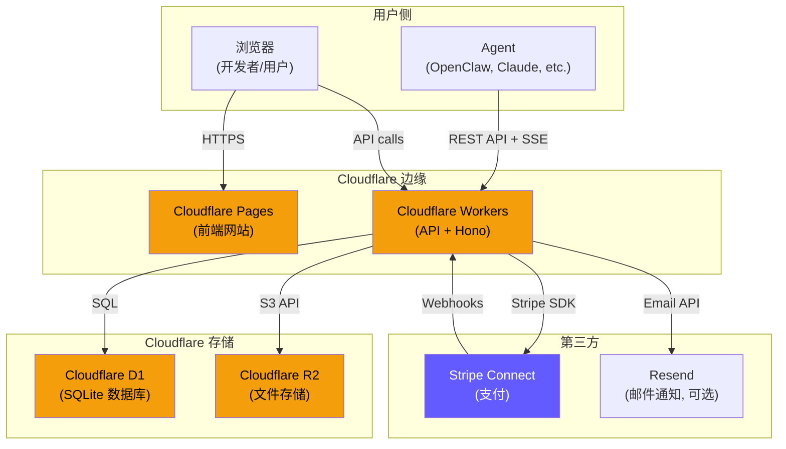
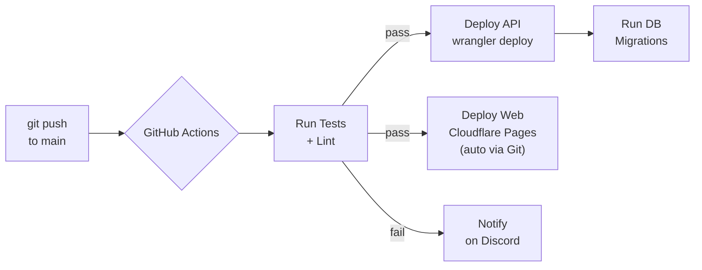

# 05 - 部署与运维

> 全部跑在 Cloudflare 上。零服务器、零运维、几乎零成本。

---

## 架构拓扑



---

## 环境规划

| 环境 | 域名 | 用途 |
|------|------|------|
| Development | localhost:8787 (API) + localhost:4321 (Web) | 本地开发 |
| Staging | staging-api.ai-boss.io / staging.ai-boss.io | 预发布测试 |
| Production | api.ai-boss.io / ai-boss.io | 正式环境 |

---

## 后端部署（Cloudflare Workers）

### 1. 项目初始化

```bash
# 在 api/ 目录
npm create hono@latest api -- --template cloudflare-workers
cd api
npm install

# 安装依赖
npm install hono stripe zod nanoid
npm install -D @cloudflare/workers-types wrangler typescript
```

### 2. wrangler.toml 完整配置

```toml
name = "ai-boss-api"
main = "src/index.ts"
compatibility_date = "2026-02-01"
compatibility_flags = ["nodejs_compat"]

# ── D1 数据库 ──
[[d1_databases]]
binding = "DB"
database_name = "ai-boss-db"
database_id = ""  # wrangler d1 create ai-boss-db 后填入

# ── R2 存储桶 ──
[[r2_buckets]]
binding = "STORAGE"
bucket_name = "ai-boss-storage"

# ── 环境变量（非敏感） ──
[vars]
ENVIRONMENT = "production"
CORS_ORIGIN = "https://ai-boss.io"

# ── Staging 环境 ──
[env.staging]
name = "ai-boss-api-staging"
[env.staging.vars]
ENVIRONMENT = "staging"
CORS_ORIGIN = "https://staging.ai-boss.io"

# Secrets（通过 CLI 设置，不进代码）：
# wrangler secret put STRIPE_SECRET_KEY
# wrangler secret put STRIPE_WEBHOOK_SECRET
# wrangler secret put ADMIN_API_KEY
```

### 3. 创建云资源

```bash
# 创建 D1 数据库
wrangler d1 create ai-boss-db
# 输出 database_id → 填入 wrangler.toml

# 创建 R2 存储桶
wrangler r2 bucket create ai-boss-storage

# 初始化数据库表
wrangler d1 execute ai-boss-db --file=src/db/schema.sql

# 设置 Secrets
wrangler secret put STRIPE_SECRET_KEY
wrangler secret put STRIPE_WEBHOOK_SECRET
wrangler secret put ADMIN_API_KEY
```

### 4. 部署命令

```bash
# 本地开发
wrangler dev

# 部署到 staging
wrangler deploy --env staging

# 部署到 production
wrangler deploy

# 查看日志
wrangler tail
```

### 5. 自定义域名

```bash
# 在 Cloudflare Dashboard 中：
# Workers & Pages → ai-boss-api → Settings → Domains & Routes
# 添加 Custom Domain: api.ai-boss.io
```

---

## 前端部署（Cloudflare Pages）

### 1. 项目初始化

```bash
# 在 web/ 目录
npm create astro@latest web -- --template basics
cd web
npx astro add react tailwind

# 安装依赖
npm install framer-motion lucide-react
```

### 2. Astro 配置

```javascript
// astro.config.mjs
import { defineConfig } from 'astro/config';
import react from '@astrojs/react';
import tailwind from '@astrojs/tailwind';
import cloudflare from '@astrojs/cloudflare';

export default defineConfig({
  output: 'hybrid',  // 静态为主，需要时 SSR
  adapter: cloudflare(),
  integrations: [react(), tailwind()],
  site: 'https://ai-boss.io',
});
```

### 3. 部署

```bash
# 本地开发
npm run dev

# 构建
npm run build

# 部署到 Cloudflare Pages（推荐用 Git 自动部署）
# 在 Cloudflare Dashboard：
# Pages → Create → Connect to Git → 选择仓库
# Build command: npm run build
# Build output: dist/
# Root directory: web/
```

### 4. 自定义域名

```
Cloudflare Pages → ai-boss-web → Custom Domains
添加: ai-boss.io
添加: www.ai-boss.io → redirect to ai-boss.io
```

---

## 域名 & DNS 规划

```
ai-boss.io
├── ai-boss.io          → Cloudflare Pages (前端)
├── www.ai-boss.io      → 301 redirect → ai-boss.io
├── api.ai-boss.io      → Cloudflare Workers (API)
└── storage.ai-boss.io  → Cloudflare R2 (公开文件访问)
```

DNS 配置（在 Cloudflare DNS）：
```
Type  Name     Content                              Proxy
CNAME @        ai-boss-web.pages.dev               ✅
CNAME www      ai-boss.io                           ✅
CNAME api      ai-boss-api.<account>.workers.dev    ✅
CNAME storage  <r2-public-url>                      ✅
```

---

## CI/CD 流程



### GitHub Actions Workflow

```yaml
# .github/workflows/deploy.yml
name: Deploy

on:
  push:
    branches: [main]

jobs:
  deploy-api:
    runs-on: ubuntu-latest
    steps:
      - uses: actions/checkout@v4
      - uses: actions/setup-node@v4
        with:
          node-version: 20
      - run: npm ci
        working-directory: api
      - run: npm run typecheck
        working-directory: api
      - run: npm test
        working-directory: api
      - uses: cloudflare/wrangler-action@v3
        with:
          apiToken: ${{ secrets.CLOUDFLARE_API_TOKEN }}
          workingDirectory: api
          command: deploy

  # Web 由 Cloudflare Pages 自动从 Git 部署，不需要 Action
```

---

## 数据库迁移策略

```
当前阶段用最简单的方案：

migrations/
├── 001_initial.sql      # 初始 4 张表
├── 002_add_xxx.sql      # 后续变更
└── ...

执行方式：
# 本地
wrangler d1 execute ai-boss-db --local --file=migrations/001_initial.sql

# 远程
wrangler d1 execute ai-boss-db --file=migrations/001_initial.sql

注意事项：
├── D1 是 SQLite，ALTER TABLE 支持有限
├── 添加列可以：ALTER TABLE x ADD COLUMN y TEXT
├── 删除列不行：需要新建表 + 迁移数据
├── 所有 migration 文件进 Git
└── 每次部署前手动执行（后续可以自动化）
```

---

## 监控 & 日志

### Cloudflare 自带

```
├── Workers Analytics  → 请求量、延迟、错误率
├── D1 Metrics         → 查询量、行读写数
├── R2 Metrics         → 存储量、请求数
└── wrangler tail      → 实时日志
```

### 自建（后续）

```
├── Sentry (错误追踪) → npm install @sentry/cloudflare
├── Logflare (日志聚合) → Cloudflare 原生集成
└── Uptime Robot (可用性监控) → 监控 /healthz 端点
```

### 健康检查端点

```typescript
// GET /healthz
app.get('/healthz', async (c) => {
  try {
    await c.env.DB.prepare('SELECT 1').first();
    return c.json({ status: 'ok', time: new Date().toISOString() });
  } catch {
    return c.json({ status: 'error' }, 500);
  }
});
```

---

## 费用估算

```
Cloudflare 免费额度（每月）：
├── Workers: 100,000 请求/天 = 300 万/月
├── D1: 500 万行读 + 10 万行写
├── R2: 10GB 存储 + 1000 万 B类请求
├── Pages: 无限静态托管
└── 总计: $0

Stripe 费用：
├── 每笔交易: 2.9% + $0.30
├── Connect 分账: 0.25% + $0.25
└── 月费: $0

域名：
├── ai-boss.io: ~$10/年
└── Cloudflare 注册域名: 成本价

总启动成本: ~$10（一个域名的钱）
```

---

## 安全清单

```
部署安全：
├── [x] HTTPS only (Cloudflare 自动)
├── [x] CORS 配置 (只允许 ai-boss.io)
├── [x] API Key 存 hash，不存明文
├── [x] Stripe Secrets 用 wrangler secret put
├── [x] Webhook 用 Stripe Signature 验证
├── [ ] Rate Limiting (后续用 Cloudflare Rate Limiting)
├── [ ] DDoS Protection (Cloudflare 自带)
└── [ ] Content Security Policy headers

数据安全：
├── [x] D1 数据不公开（只通过 Workers 访问）
├── [x] R2 文件需要签名 URL 访问
├── [x] 交付物审核后才移交客户
├── [ ] 定期备份 D1（wrangler d1 export）
└── [ ] PII 数据（邮箱等）加密存储（后续）
```

---

## 本地开发环境

```bash
# 环境要求
Node.js >= 20
npm >= 10

# 克隆项目
git clone https://github.com/xxx/openclaw-market.git
cd openclaw-market

# 安装后端依赖
cd api && npm install

# 安装前端依赖
cd ../web && npm install

# 启动后端（本地模拟 Cloudflare Workers）
cd ../api && wrangler dev
# → http://localhost:8787

# 启动前端
cd ../web && npm run dev
# → http://localhost:4321

# 初始化本地数据库
wrangler d1 execute ai-boss-db --local --file=src/db/schema.sql
```
