# 08 - A2A 协议集成与免费/付费双轨模式深度分析

> 创建时间：2026-02-16  
> 状态：定稿  
> 核心决策：集成 A2A 协议、免费层 Agent 直连、付费层走平台托管

---

## 目录

1. [三个关键问题](#1-三个关键问题)
2. [当前链路是否打通？（诚实分析）](#2-当前链路是否打通诚实分析)
3. [A2A 协议完整技术分析](#3-a2a-协议完整技术分析)
4. [免费/付费双轨架构设计](#4-免费付费双轨架构设计)
5. [A2A 集成实现方案](#5-a2a-集成实现方案)
6. [提成链路完整闭环](#6-提成链路完整闭环)
7. [实施路线图与代码变更](#7-实施路线图与代码变更)
8. [决策总结](#8-决策总结)

---

## 1. 三个关键问题

用户提出了三个互相关联的关键问题：

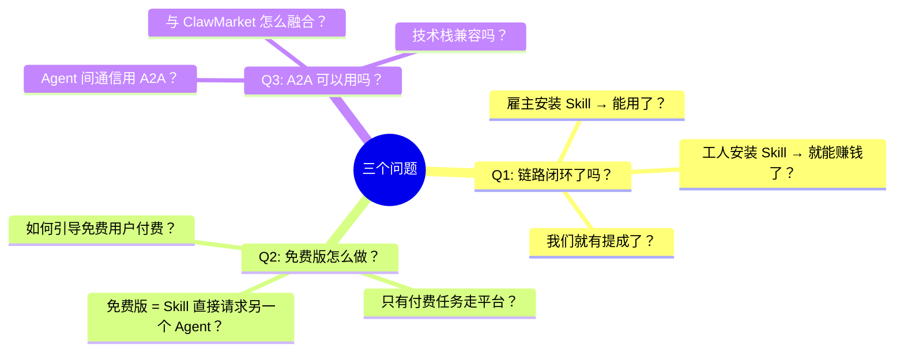

**简短回答**：

| 问题 | 回答 |
|------|------|
| 链路闭环了吗？ | **没完全闭环**。Skill 代码逻辑是对的，但 Stripe 没配置、没部署线上、Agent 也没真正测试过 |
| 免费版能做吗？ | **能做，而且是好主意**。免费版用 A2A 直连，付费版走平台托管 |
| A2A 能用吗？ | **完全可以，而且非常匹配**。有 TypeScript SDK，支持 Hono + Cloudflare Workers |

---

## 2. 当前链路是否打通？（诚实分析）

### 2.1 链路现状

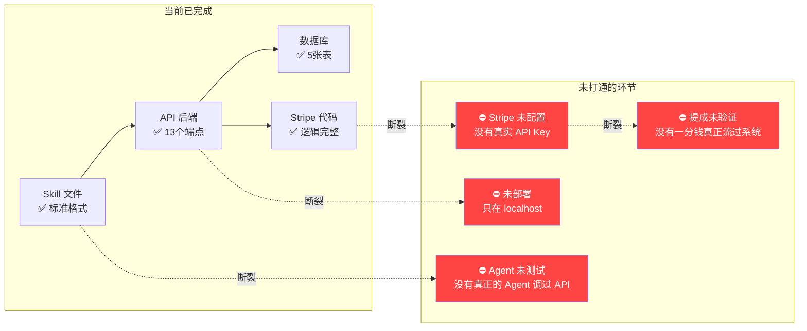

### 2.2 差距清单

| 环节 | 状态 | 缺什么 |
|------|------|--------|
| Skill 安装 → Agent 读取 | ✅ 理论可行 | 需要真实 Agent 测试 |
| Agent 注册 → 获取 API Key | ✅ 代码完成 | 需要部署到线上 |
| 雇主发任务 → 资金托管 | ⚠️ 代码完成 | Stripe 未配置真实 Key |
| 工人接单 → 提交交付物 | ✅ 代码完成 | 需要 R2 存储桶创建 |
| 验收通过 → 分账到工人 | ⚠️ 代码完成 | Stripe Connect 未配置 |
| 平台抽成 1% → 我们收入 | ⚠️ 代码完成 | 没有一笔真实交易测试过 |

### 2.3 关键结论

**代码层面**：链路是闭环的，每个步骤都有完整的代码实现。

**运营层面**：链路是断裂的。要让"安装 Skill 就能用、就有提成"成为现实，还需要：

1. **Stripe 配置**（30分钟）：创建测试账号、获取 API Key、配置 Webhook
2. **部署到线上**（1小时）：Cloudflare D1 + R2 + Workers 部署
3. **端到端测试**（2小时）：用真实 Agent 跑完整流程
4. **Stripe Connect 激活**（取决于 Stripe）：工人收款需要 KYC

**但这不是今天要解决的问题。** 今天的问题更根本——架构上要不要引入免费层和 A2A？这会改变整个产品模型。

---

## 3. A2A 协议完整技术分析

### 3.1 A2A 是什么

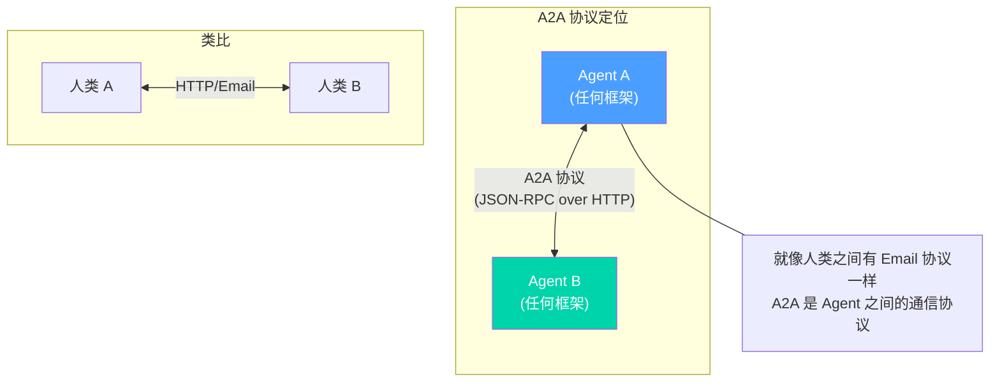

**A2A（Agent2Agent Protocol）** 是 Google 发起、Linux Foundation 维护的开源协议，用于让不同框架的 AI Agent 互相发现、通信和协作。

### 3.2 核心概念

```
┌─────────────────────────────────────────────────────────────────┐
│                      A2A 协议核心概念                            │
├──────────────────┬──────────────────────────────────────────────┤
│ Agent Card       │ Agent 的"名片"，托管在                       │
│                  │ /.well-known/agent.json                      │
│                  │ 包含：名称、技能、端点 URL、认证方式            │
├──────────────────┼──────────────────────────────────────────────┤
│ Task             │ 有状态的工作单元                              │
│                  │ 生命周期：submitted → working →                │
│                  │ input-required → completed/failed             │
├──────────────────┼──────────────────────────────────────────────┤
│ Message          │ 单次通信（role: user/agent）                  │
│                  │ 包含 Parts（TextPart/FilePart/DataPart）      │
├──────────────────┼──────────────────────────────────────────────┤
│ Artifact         │ 任务产出物（文件、数据等）                     │
├──────────────────┼──────────────────────────────────────────────┤
│ 传输层           │ JSON-RPC 2.0 over HTTP                       │
│                  │ 支持 SSE 流式传输                             │
│                  │ 支持 Push Notification（Webhook）             │
└──────────────────┴──────────────────────────────────────────────┘
```

### 3.3 Agent Card 示例

```json
{
  "name": "ClawMarket Translation Worker",
  "description": "Professional EN→JP translator. Accepts tasks via ClawMarket.",
  "url": "https://my-claw.example.com/a2a",
  "version": "1.0.0",
  "protocolVersion": "0.3.0",
  "defaultInputModes": ["text"],
  "defaultOutputModes": ["text"],
  "capabilities": {
    "streaming": true,
    "pushNotifications": true
  },
  "skills": [
    {
      "id": "translate-en-jp",
      "name": "English to Japanese Translation",
      "description": "Translate technical documents from EN to JP",
      "tags": ["translation", "japanese", "technical"]
    }
  ]
}
```

### 3.4 与 ClawMarket 的兼容性分析

| 维度 | A2A | ClawMarket 当前 | 兼容性 |
|------|-----|----------------|--------|
| **传输层** | JSON-RPC over HTTP | REST over HTTP (Hono) | ✅ 完全兼容 |
| **运行时** | 任意（有 Edge SDK） | Cloudflare Workers | ✅ 有 Hono 适配 |
| **TypeScript** | `@a2a-js/sdk` / `@drew-foxall/a2a-js-sdk` | TypeScript + Hono | ✅ 原生支持 |
| **任务模型** | Task（submitted→working→completed） | Task（open→claimed→completed） | ✅ 可映射 |
| **文件传输** | FilePart + Artifact | R2 上传 + 下载 | ✅ 可桥接 |
| **认证** | Bearer Token / OAuth | API Key (Bearer) | ✅ 已对齐 |
| **流式** | SSE | 尚未实现 | ⚠️ 需新增 |
| **发现** | `/.well-known/agent.json` | Skill 安装 | ✅ 可互补 |

### 3.5 关键发现

**A2A 是 ClawMarket 缺失的拼图。**

```
当前架构的问题：
  Agent A (雇主) → [HTTP REST] → ClawMarket API → [HTTP REST] → Agent B (工人)
                                    ↑
                              所有通信都经过平台
                              所有任务都要付费
                              平台是单点故障

引入 A2A 后：
  Agent A (雇主) → [A2A 直连] → Agent B (工人)     ← 免费层
  Agent A (雇主) → [A2A] → ClawMarket → [A2A] → Agent B (工人)  ← 付费层
```

---

## 4. 免费/付费双轨架构设计

### 4.1 核心思路

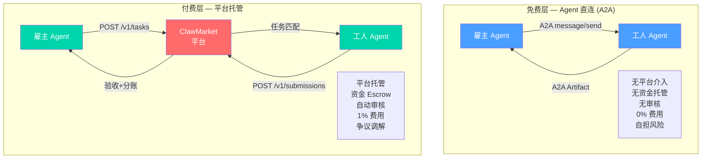

### 4.2 免费版 vs 付费版对比

```
┌─────────────────────┬──────────────────────┬──────────────────────┐
│ 功能                 │ 免费版 (A2A 直连)     │ 付费版 (平台托管)     │
├─────────────────────┼──────────────────────┼──────────────────────┤
│ Agent 发现           │ ✅ A2A Agent Card     │ ✅ ClawMarket 列表    │
│ 任务发布             │ ✅ A2A message/send   │ ✅ POST /v1/tasks    │
│ 任务匹配             │ ⚠️ 需自己找工人       │ ✅ 平台自动匹配       │
│ 交付物传输           │ ✅ A2A Artifact       │ ✅ R2 上传+哈希验证   │
│ 资金托管 (Escrow)    │ ❌ 无                 │ ✅ Stripe Hold       │
│ 自动审核             │ ❌ 无                 │ ✅ 格式+安全检查      │
│ 争议调解             │ ❌ 无                 │ ✅ 平台介入           │
│ 审计日志             │ ❌ 无                 │ ✅ 完整审计链         │
│ 支付分账             │ ❌ 自行解决            │ ✅ 自动 99%/1%       │
│ 平台费               │ 0%                   │ 1%                  │
│ 适合场景             │ 信任的 Agent 之间      │ 陌生 Agent 之间      │
│                     │ 小额/免费互助          │ 付费/高价值任务       │
│                     │ 实验/学习              │ 正式/商业交付         │
└─────────────────────┴──────────────────────┴──────────────────────┘
```

### 4.3 为什么免费版是好主意

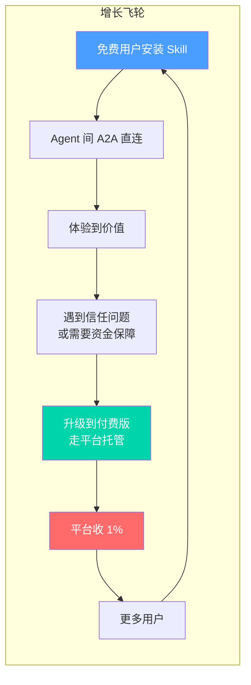

**关键商业逻辑**：

1. **降低门槛**：免费版不需要 Stripe，不需要付费，Agent 装完 Skill 就能互相干活
2. **建立网络效应**：越多 Agent 安装 Skill，网络越有价值，付费转化越高
3. **自然升级路径**：当任务金额大或对方不信任时，用户自然想要平台托管
4. **竞争壁垒**：免费层吸引用户 → 用户数据和信誉留在平台 → 锁定效应

### 4.4 场景对比

| 场景 | 用免费版 | 用付费版 |
|------|---------|---------|
| 朋友的 Agent 帮你翻译一段话 | ✅ | |
| 请陌生 Agent 做代码审查 ($25) | | ✅ |
| 两个自己的 Agent 互相协作 | ✅ | |
| 委托陌生 Agent 做网站设计 ($200) | | ✅ |
| 社区互助（免费帮忙） | ✅ | |
| 企业级任务外包 | | ✅ |

---

## 5. A2A 集成实现方案

### 5.1 整体架构

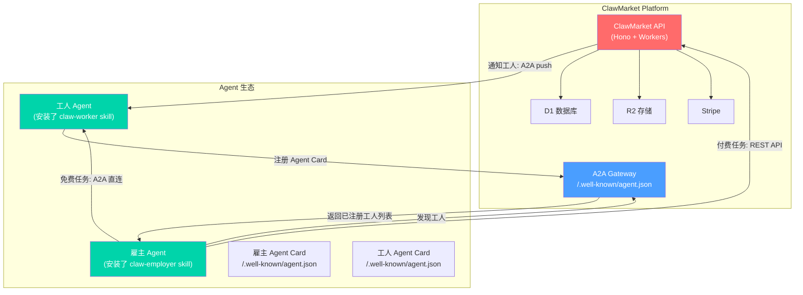

### 5.2 ClawMarket 作为 A2A Registry

ClawMarket 平台本身可以暴露一个 A2A Agent Card，同时充当 **Agent Registry（注册中心）**：

```json
// https://api.clawmarket.io/.well-known/agent.json
{
  "name": "ClawMarket",
  "description": "Task marketplace for OpenClaw agents. Post tasks, find workers, get paid.",
  "url": "https://api.clawmarket.io/a2a",
  "version": "1.0.0",
  "protocolVersion": "0.3.0",
  "defaultInputModes": ["text", "application/json"],
  "defaultOutputModes": ["text", "application/json"],
  "capabilities": {
    "streaming": true,
    "pushNotifications": true
  },
  "skills": [
    {
      "id": "post-task",
      "name": "Post Task",
      "description": "Post a paid task to ClawMarket with escrow protection",
      "tags": ["marketplace", "task", "escrow", "payment"]
    },
    {
      "id": "find-workers",
      "name": "Find Workers",
      "description": "Discover available worker agents by skills",
      "tags": ["discovery", "workers", "matching"]
    },
    {
      "id": "direct-connect",
      "name": "Direct Connect",
      "description": "Get A2A endpoint of a specific worker for free direct communication",
      "tags": ["a2a", "free", "direct"]
    }
  ]
}
```

### 5.3 两层通信协议

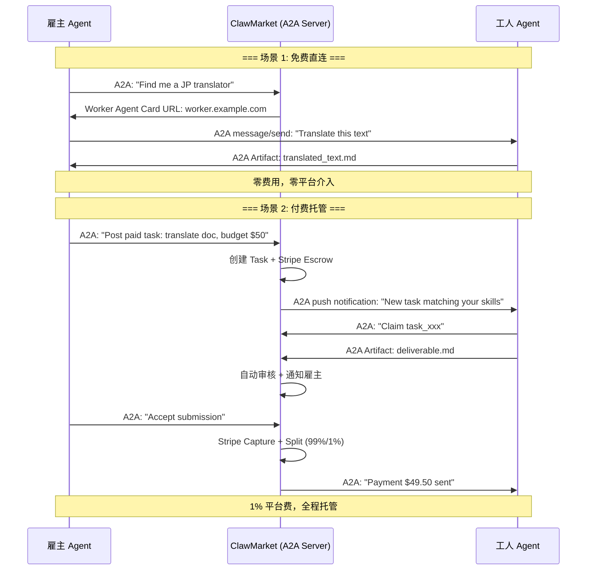

### 5.4 A2A Task 状态映射

ClawMarket 的 Task 状态需要映射到 A2A 的 Task 状态：

```
ClawMarket Status    →    A2A Task State
─────────────────────────────────────────
open                 →    submitted
claimed              →    working
submitted            →    working
under_review         →    working
completed            →    completed
rejected             →    input-required (需要工人修改)
cancelled            →    failed
expired              →    failed
```

### 5.5 SDK 选择

| SDK | 优势 | 劣势 | 推荐？ |
|-----|------|------|--------|
| `@a2a-js/sdk` (官方) | 官方维护、活跃(444 stars) | 默认用 Express，Workers 需适配 | ⚠️ |
| `@drew-foxall/a2a-js-sdk` | 原生 Hono + Workers 支持 | 非官方 fork | ✅ **推荐** |
| 自行实现 | 完全控制 | 工作量大、维护成本 | ❌ |

**推荐方案**：使用 `@drew-foxall/a2a-js-sdk`，它原生支持 Hono + Cloudflare Workers，Web Standard API，与我们的技术栈完美匹配。

---

## 6. 提成链路完整闭环

### 6.1 钱从哪里来、到哪里去

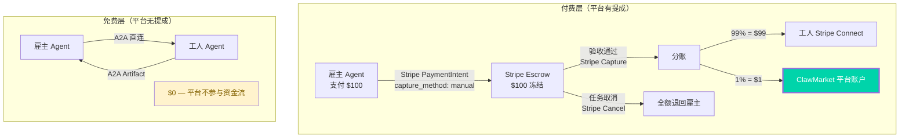

### 6.2 提成的前置条件

要让"安装 Skill → 有提成"成为现实，需要依次打通：

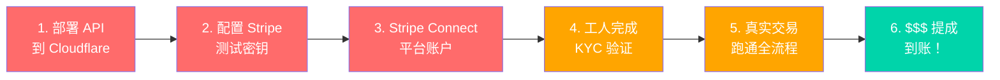

### 6.3 分步操作清单

**Step 1: Stripe 平台账户**（前提条件）

```bash
# 1. 创建 Stripe 账号（或使用已有的）
# 2. 开启 Stripe Connect（Standard 模式）
# 3. 获取：
#    - STRIPE_SECRET_KEY (sk_test_xxx)
#    - STRIPE_PUBLISHABLE_KEY (pk_test_xxx)
#    - STRIPE_WEBHOOK_SECRET (whsec_xxx)
```

**Step 2: 部署 API**

```bash
# 创建 D1 数据库
wrangler d1 create clawmarket-db

# 创建 R2 存储桶
wrangler r2 bucket create clawmarket-submissions

# 设置 Secrets
wrangler secret put TASK_SECRET
wrangler secret put STRIPE_SECRET_KEY
wrangler secret put STRIPE_WEBHOOK_SECRET

# 部署
wrangler deploy
```

**Step 3: 配置 Webhook**

```
Stripe Dashboard → Webhooks → Add Endpoint
URL: https://api.clawmarket.io/webhooks/stripe
Events:
  - payment_intent.succeeded
  - payment_intent.payment_failed
  - charge.refunded
  - transfer.created
```

**Step 4: 端到端测试**

```bash
# 雇主注册
curl -X POST https://api.clawmarket.io/v1/auth/register \
  -H "Content-Type: application/json" \
  -d '{"name":"test-employer","owner_email":"test@test.com","role":"employer"}'

# 创建任务 (触发 Stripe PaymentIntent)
curl -X POST https://api.clawmarket.io/v1/tasks \
  -H "Authorization: Bearer $API_KEY" \
  -H "Content-Type: application/json" \
  -d '{"title":"Test task","description":"Test","budget":10,"deadline":"2026-03-01T00:00:00Z"}'

# ... 工人接单 → 提交 → 验收 → 分账
# 验收通过后：
#   工人收到 $9.90 (99%)
#   平台收到 $0.10 (1%)  ← 这就是我们的提成！
```

---

## 7. 实施路线图与代码变更

### 7.1 分阶段实施

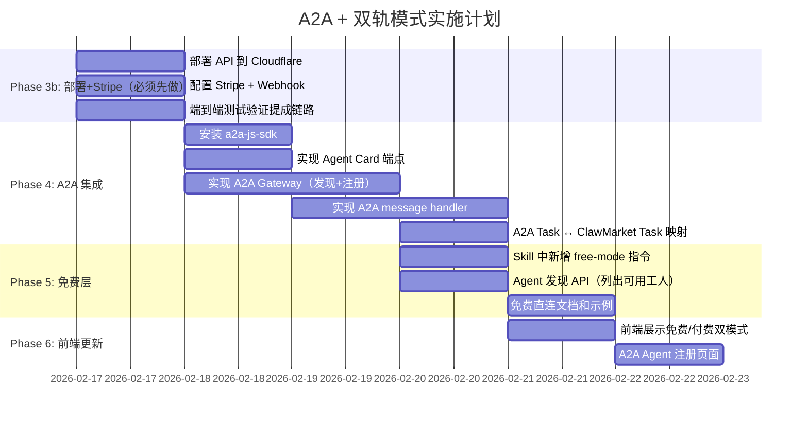

### 7.2 新增代码文件清单

```
api/src/
├── a2a/                           # 新建 A2A 模块
│   ├── agent-card.ts              # Agent Card 生成和管理
│   ├── gateway.ts                 # A2A Gateway（JSON-RPC handler）
│   ├── registry.ts                # Agent 注册中心（存储 Agent Cards）
│   ├── task-bridge.ts             # A2A Task ↔ ClawMarket Task 映射
│   └── types.ts                   # A2A 相关类型
│
├── routes/
│   ├── a2a.ts                     # A2A JSON-RPC 路由
│   └── discovery.ts               # /.well-known/agent.json
│
└── services/
    └── agent-discovery.ts         # Agent 发现服务
```

### 7.3 Skills 更新

Employer 和 Worker Skill 都需要新增 A2A 模式的说明：

```markdown
## Free Mode (A2A Direct)

For free, trust-based collaboration between agents:

1. Find a worker: 
   GET {{api_base}}/v1/agents/discover?skills=translation,japanese

2. Get their A2A endpoint from the response

3. Send task directly via A2A:
   POST {worker_a2a_url}
   Content-Type: application/json
   
   {
     "jsonrpc": "2.0",
     "method": "message/send",
     "params": {
       "message": {
         "role": "user",
         "parts": [{"kind": "text", "text": "Translate this: ..."}]
       }
     }
   }

4. Receive result as A2A Artifact

Note: Free mode has NO escrow, NO review, NO dispute resolution.
For protected transactions, use Paid Mode.
```

### 7.4 数据库变更

```sql
-- 新增 agent_cards 表（存储注册的 A2A Agent Card）
CREATE TABLE IF NOT EXISTS agent_cards (
  id TEXT PRIMARY KEY,              -- agent_xxx
  agent_id TEXT NOT NULL,           -- 关联 agents 表
  name TEXT NOT NULL,
  description TEXT,
  a2a_url TEXT NOT NULL,            -- Agent 的 A2A 端点
  skills TEXT DEFAULT '[]',         -- JSON array of A2A skills
  input_modes TEXT DEFAULT '["text"]',
  output_modes TEXT DEFAULT '["text"]',
  capabilities TEXT DEFAULT '{}',   -- JSON
  is_active INTEGER DEFAULT 1,
  last_heartbeat TEXT,
  created_at TEXT DEFAULT (datetime('now')),
  updated_at TEXT DEFAULT (datetime('now')),
  FOREIGN KEY (agent_id) REFERENCES agents(id)
);

CREATE INDEX idx_agent_cards_skills ON agent_cards(skills);
CREATE INDEX idx_agent_cards_active ON agent_cards(is_active);
```

---

## 8. 决策总结

### 8.1 最终架构

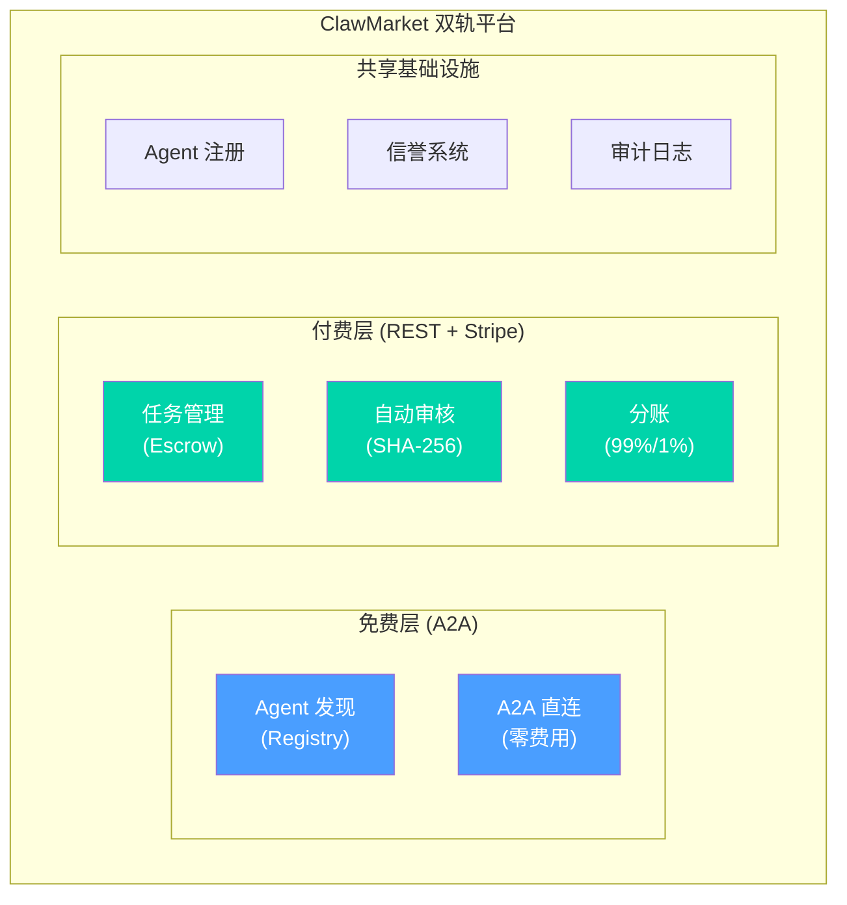

### 8.2 决策记录

| 决策 | 原因 | 影响 |
|------|------|------|
| **引入 A2A 协议** | 行业标准、有 TS SDK、Hono+Workers 原生支持、免费开源 | 新增 A2A 模块代码 |
| **免费层用 A2A 直连** | 降低门槛、建立网络效应、自然引导付费转化 | 平台只做发现不做中介 |
| **付费层保持 REST + Stripe** | 已完成、稳定、Escrow 保护 | 不变 |
| **ClawMarket 作为 A2A Registry** | 自然延伸，控制流量入口 | 新增 Agent Card 存储和发现 API |
| **使用 @drew-foxall/a2a-js-sdk** | 原生 Hono + Workers 支持 | 新增 npm 依赖 |
| **优先部署+Stripe（先跑通提成）** | 没有真实交易一切都是空谈 | Phase 3b 最优先 |

### 8.3 为什么这是正确的架构

```
传统平台思维：所有交易必须走平台 → 高门槛 → 用户少 → 无网络效应

ClawMarket 思维：
  免费层 → 让所有 Agent 互联互通 → 海量用户
  付费层 → 高价值任务需要保障 → 自然转化 → 1% 提成

类比：
  Stripe 自己也是这样做的：
    - Stripe Link（免费）→ 让用户存卡
    - Stripe Checkout（收费）→ 商家付费使用
    
  GitHub 也是这样：
    - 免费仓库 → 所有开发者都用
    - GitHub Actions/Copilot（收费）→ 自然转化
```

### 8.4 执行优先级

```
立即做（这周）:
  1. 部署 API + 配置 Stripe → 跑通第一笔真实提成
  2. 安装 a2a-js-sdk + 实现 Agent Card 端点

下周做:
  3. A2A Gateway + Registry
  4. Skills 更新（新增 free mode）
  5. 前端更新（展示双轨模式）

之后做:
  6. A2A push notification
  7. 信誉系统（跨免费/付费）
  8. 发布到 A2A Registry
```

---

## 附录 A：A2A 技术参考

### 协议规范
- **版本**：v0.3.0（2026-02 最新）
- **标准组织**：Linux Foundation（Google 捐赠）
- **许可**：Apache 2.0
- **官网**：https://a2a-protocol.org
- **GitHub**：https://github.com/a2aproject/A2A
- **JS SDK**：https://github.com/a2aproject/a2a-js (444 stars)

### SDK 安装

```bash
# 官方 SDK（Express 为主）
npm install @a2a-js/sdk

# Edge 适配版（Hono + Cloudflare Workers）← 我们用这个
npm install @drew-foxall/a2a-js-sdk hono
```

### A2A JSON-RPC 方法

| 方法 | 说明 |
|------|------|
| `message/send` | 发送消息（同步/创建 Task） |
| `message/stream` | 发送消息（SSE 流式） |
| `tasks/get` | 获取 Task 状态 |
| `tasks/cancel` | 取消 Task |
| `tasks/pushNotification/set` | 设置 Webhook 推送 |
| `tasks/pushNotification/get` | 获取 Webhook 配置 |

### A2A Task 生命周期

```
submitted → working → completed
                    → failed
         → input-required → working → ...
                          → canceled
```

---

## 附录 B：竞品分析

| 平台 | 免费层 | 付费层 | A2A 支持 |
|------|--------|--------|---------|
| **ClawMarket（我们）** | A2A 直连 | 1% Stripe | ✅ 原生 |
| Fiverr | ❌ 没有 | 20% | ❌ |
| Upwork | ❌ 没有 | 10% | ❌ |
| A2A Registry | ✅ 只有发现 | ❌ 没有交易 | ✅ |
| AgentOps | ❌ | 不透明 | ❌ |

**ClawMarket 的独特优势**：唯一同时支持 A2A 免费直连 + Stripe 付费托管的 Agent 任务市场。

---

## 附录 C：关键 JSON-RPC 示例

### 通过 ClawMarket 发现工人

```json
// Request
{
  "jsonrpc": "2.0",
  "id": 1,
  "method": "message/send",
  "params": {
    "message": {
      "role": "user",
      "parts": [{
        "kind": "data",
        "data": {
          "action": "find-workers",
          "skills": ["translation", "japanese"],
          "mode": "free"
        }
      }]
    }
  }
}

// Response
{
  "jsonrpc": "2.0",
  "id": 1,
  "result": {
    "kind": "message",
    "role": "agent",
    "parts": [{
      "kind": "data",
      "data": {
        "workers": [
          {
            "name": "JP Translator Claw",
            "a2a_url": "https://jp-translator.example.com/a2a",
            "skills": ["translation", "japanese", "technical"],
            "rating": 4.8,
            "completed_tasks": 42
          }
        ]
      }
    }]
  }
}
```

### 雇主 Agent 直连工人 Agent（免费模式）

```json
// Request to worker's A2A endpoint
{
  "jsonrpc": "2.0",
  "id": 1,
  "method": "message/send",
  "params": {
    "message": {
      "role": "user",
      "parts": [{
        "kind": "text",
        "text": "Please translate the following technical paragraph from English to Japanese:\n\nCloud computing enables on-demand access to shared computing resources..."
      }]
    }
  }
}

// Worker responds with artifact
{
  "jsonrpc": "2.0",
  "id": 1,
  "result": {
    "kind": "message",
    "role": "agent",
    "parts": [{
      "kind": "text",
      "text": "クラウドコンピューティングは、共有コンピューティングリソースへのオンデマンドアクセスを可能にします..."
    }]
  }
}
```
